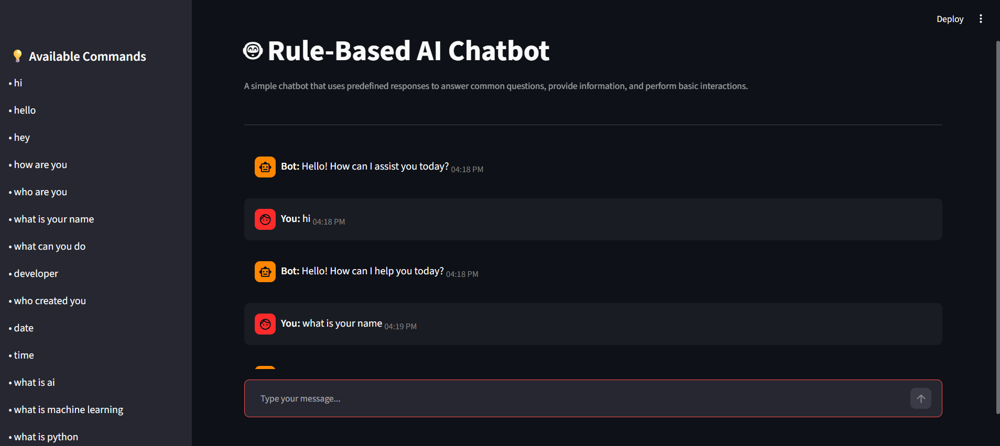

# 🤖 Rule-Based AI Chatbot

A simple Rule-Based AI Chatbot developed using Python and Streamlit. The chatbot responds to predefined user commands and demonstrates basic Artificial Intelligence concepts through rule-based decision making.

## 📌 Project Overview

This project was developed to explore the fundamentals of chatbot development using Python. Instead of using Machine Learning or Large Language Models, the chatbot relies on predefined rules and responses to interact with users.

The chatbot can answer common questions, provide information, tell jokes, display the current date and time, and perform basic conversational interactions.

## ✨ Features

- Interactive chat interface using Streamlit
- Rule-based response system
- Predefined command handling
- Date and time information
- AI, Machine Learning, and Python-related responses
- Motivational quotes and jokes
- Typing indicator simulation
- Chat history support
- Clear chat functionality
- User-friendly interface

## 🛠️ Technologies Used

- Python
- Streamlit

## 📂 Project Structure

```text
Rule-Based-AI-Chatbot/
│
├── app.py
├── chatbot.py
├── responses.py
├── requirements.txt
├── README.md
└── assets/
```

## 💬 Available Commands

- hi
- hello
- hey
- how are you
- who are you
- what is your name
- what can you do
- developer
- who created you
- date
- time
- what is ai
- what is machine learning
- what is python
- joke
- quote
- help
- bye

## 🚀 Installation

### Clone the Repository

```bash
git clone https://github.com/your-username/Rule-Based-AI-Chatbot.git
```

### Navigate to the Project Directory

```bash
cd Rule-Based-AI-Chatbot
```

### Install Dependencies

```bash
pip install -r requirements.txt
```

### Run the Application

```bash
streamlit run app.py
```

## 📸 Output Screenshot

```markdown

```

## 🎯 Learning Outcomes

Through this project, the following concepts were explored:

- Rule-Based Systems
- Conditional Statements
- Decision Making Logic
- Python Functions
- Dictionary-Based Data Storage
- Streamlit User Interface Development
- Session State Management

## 👩‍💻 Developer

**Rimsha Shehzadi**

Software Engineer

## 📄 License

This project is developed for educational and learning purposes.